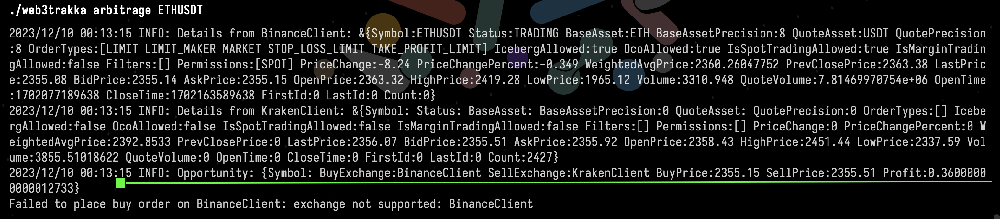

# web3trakka
My personal CLI tool for managing my crypto portfolio, finding arbitrage opportunities, and setting
price alerts.

.

## Running the app
Use this `Makefile`:
- Run the application locally: `make run`
- Run the application in Docker: `make docker-up`
- Stop the Docker containers: `make docker-down`
- Clean up the built files: `make clean`

## Available commands
- You can track a crypto pair using the `track` command.
- You can set price alerts to buy a pair at a certain price using the `alert` command.
- You can also view your portfolio using the `view` command.

To see how a command works, run this to show help:
```shell
./web3trakka <command> help
```

## Tracking Crypto Pairs
To track a crypto pair, say ETHUSDT, just run:

```shell
make build
# then
./web3trakka track ETHUSDT
```
